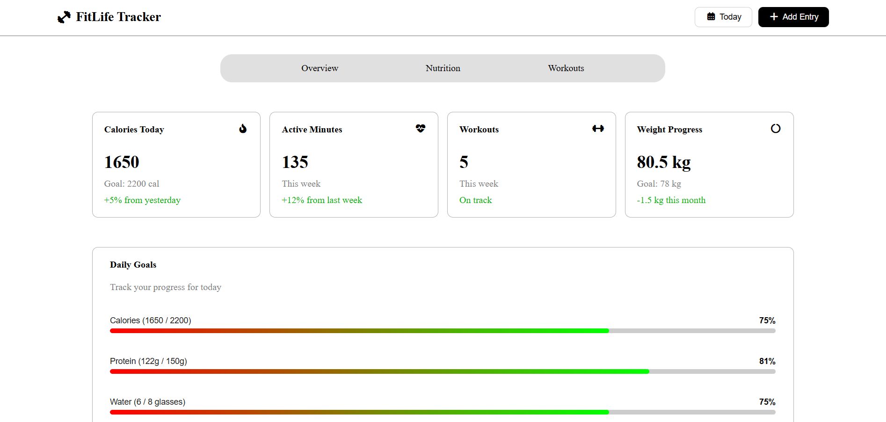
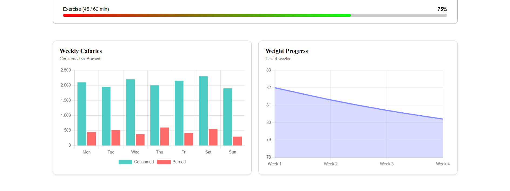
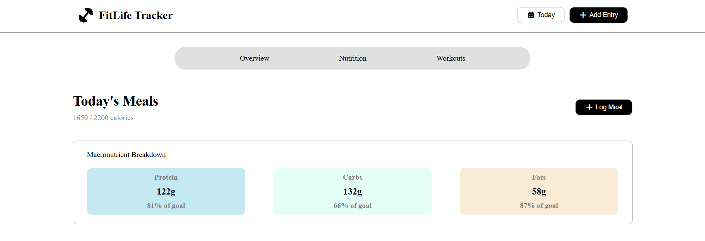
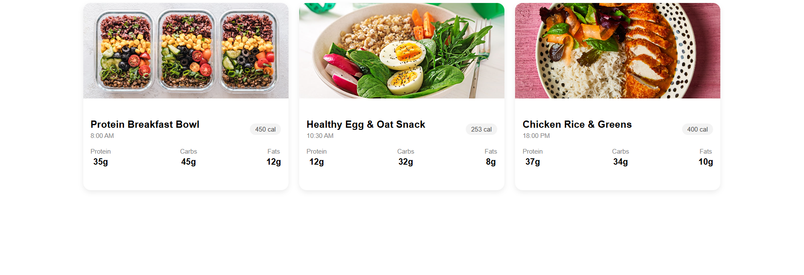
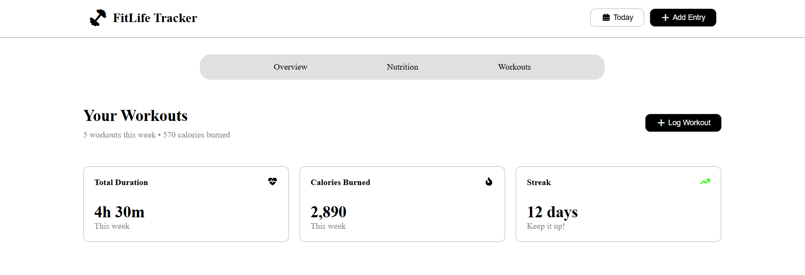
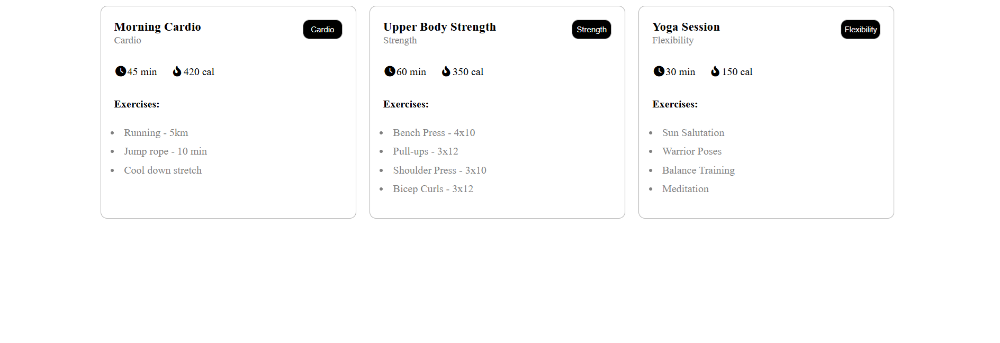

# 🏋️‍♂️ FitLife Tracker

A simple and responsive **fitness & nutrition tracking website** built using **HTML, CSS, and Charts.css**.

---

## 📌 Overview

FitLife Tracker helps users follow their health journey through three main sections:

- 📍 **Overview** – Daily summary of health stats  
- 🍏 **Nutrition** – Calorie intake & meal tracking  
- 🏃 **Workouts** – Exercise routines and fitness planning  

The site also includes two visual progress charts:

- 📊 **Weekly Calories**
- ⚖️ **Weight Progress**

Both charts were created using **Charts.css**, with no JavaScript required.

---

## 🛠️ Tech Stack

- **HTML5** 🌐  
- **CSS3** 🎨  
- **Charts.css** 📊  

---

## ✨ Features

- 📱 Fully responsive design  
- 🌈 Clean and modern UI  
- 📊 Lightweight CSS-based charts  
- 🔥 Beginner-friendly code structure  

---

## 🎥 **Preview**
  

---

## 🌐 **Live Demo**
The website is hosted on GitHub Pages: [View Live Site]()  

--
